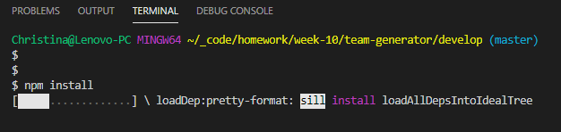
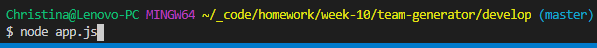
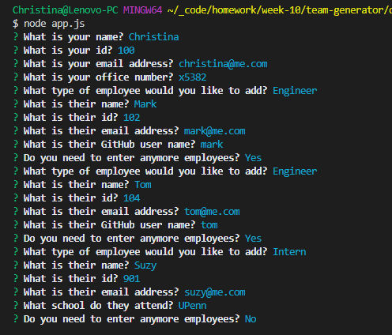
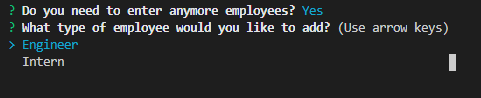
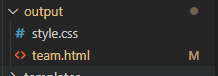

# Team Generator 

### Unit 10 OOP Homework: Template Engine - Employee Summary 

## Description 

Using your terminal, you can run the Team Generator application that will prompt you for information to create a web page that contains information about your team members. You'll enter information as the manager for your Engineers and Interns. After completing the data entry, you will be given an html page that you can open in your browser.

## Table of Contents 

* [Installation](#installation)
* [Usage](#usage)
* [License](#license)
* [Questions](#questions)

## Installation 

Using GitHub, clone or fork the repository. You'll need to get the repo pulled to your local repository. Once you have the repo locally, be sure to run npm install from your terminal to install inquirer and all other dependencies for the application. 

 

If you plan to push the repo back to your GitHub repo, be sure to add a .gitignore file to your root folder and ignore node_modules and .DS_Store/ . 

## Usage 

#### Access a step-by-step video here: tbd
#### Repo link: https://github.com/cbayley-edu/team-generator

This application contains tests. Access the test folder and type run npm test in the terminal.

Make sure you are in the develop folder of the project in your terminal and type node app.js.

As you are prompted, answer the questions and hit enter. 

Some fields contain validation. The name field is required. The id field is also required and must contain a number. The email address, while not required, must contain the @ sign. As you answer questions you will be prompted whether or not you want to add more employees. The default is Y. If you type Y or simply hit enter, you will be prompted again for the employee type (Engineer or Intern). When you are finished entering employees, simply answer N.

After responding no, the program will end in the terminal. If one does not already exist, an output folder will be created in your develop folder in your project. Within this folder, a team.html file will be created using the various html templates in the template folder and the style.css file will also be copied from the templates folder.

  

## License 

This project is covered by the above license(s). Click on the badge for more information.

## Questions 

GitHub username: cbayley-edu
GitHub profile link: https://github.com/cbayley-edu

Please email me at christinabayley@comcast.net with any questions you have or any issues you come across.
